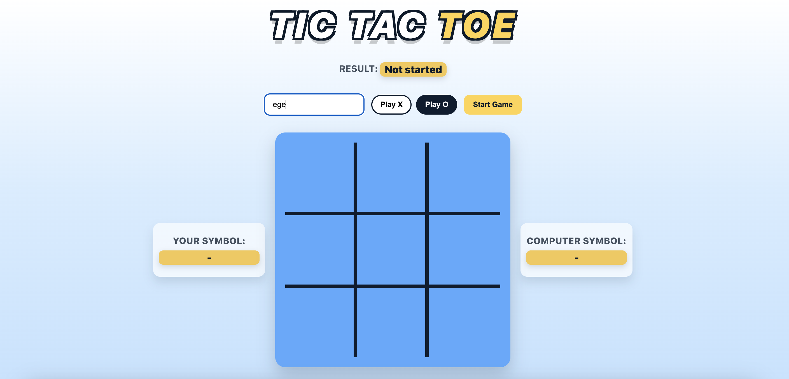
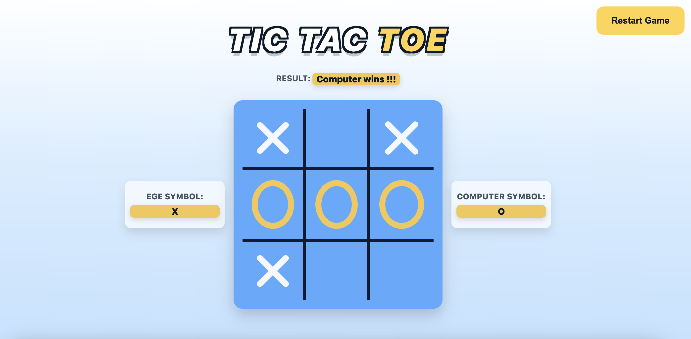
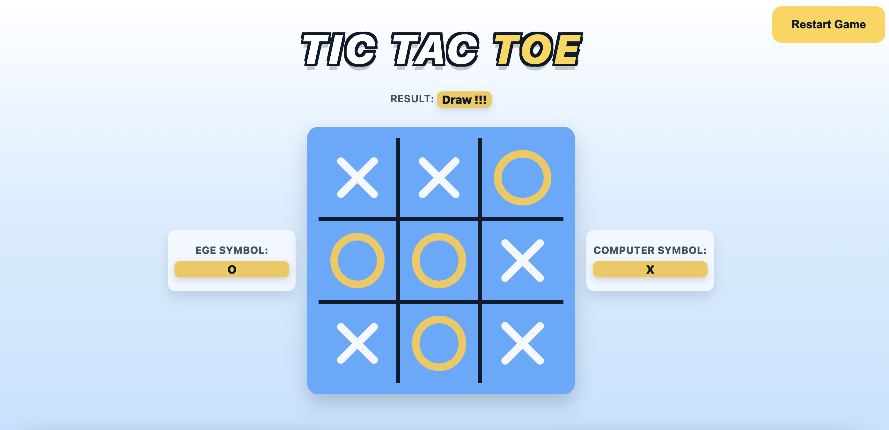

# XOX

XOX is a full-stack tic-tac-toe game with a Flask backend and a React
frontend. The computer player uses the minimax algorithm, so its moves are
calculated, not random.

## Features
- Flask REST API with SQLAlchemy models and migrations
- Minimax-based AI for computer moves
- React UI with animated X/O drawing and game status

## Screenshots




## Tech Stack
Backend:
- Flask, Flask-Migrate, SQLAlchemy, flask-cors
- PostgreSQL

Frontend:
- React (react-scripts)
- CSS (custom styles)

## Project Structure
```
backend/
  app/
    __init__.py        # Flask app factory, DB, CORS
    routes.py          # /start_game, /make_move
    models.py          # SQLAlchemy models
    game_logic.py      # Minimax and game rules
  migrations/          # Alembic migrations
  tests/               # Backend tests
  run.py               # App entrypoint

frontend/
  public/              # Static index.html
  src/
    App.js             # API calls + state
    App.css            # UI styles
    components/        # Header, GameBoard
```

## Requirements
- Python 3.9+ and pip
- PostgreSQL
- Node.js 18+ and npm

## Backend Setup
1) Virtual env and dependencies:
   - `python3 -m venv .venv`
   - `source .venv/bin/activate`
   - `pip install -r backend/requirements.txt`

2) Environment variables:
   Copy the example file and adjust values for your environment:
   - `cp backend/env.example backend/.env`

3) Database (optional migration):
   - `cd backend`
   - `flask db migrate -m "init"`
   - `flask db upgrade`

## Frontend Setup
```
cd frontend
npm install
```

## Run
Backend:
```
cd backend
source ../.venv/bin/activate
python run.py
```

Frontend:
```
cd frontend
npm start
```

The frontend calls `http://127.0.0.1:5000`. If you change the backend host
or port, update `API_BASE` in `frontend/src/App.js`.

## API
### POST /start_game
Example request:
```
{
  "player_symbol": "O",
  "username": "example"
}
```

### POST /make_move
Example request:
```
{
  "game_id": 3,
  "move": 4
}
```

## Game Logic (AI)
The AI uses minimax with depth-based scoring:
- A winning state for the computer scores higher as depth decreases.
- A winning state for the player scores lower as depth increases.
- Draws score `0`.

On each computer turn, `best_move()` evaluates all possible moves and selects
the move with the best minimax score. If the player chooses `O`, the computer
automatically makes the first move.

## Tests
We use tests to validate the core game rules and API behavior:
- `test_game_logic.py` covers win detection (horizontal, vertical, diagonal)
  and no-win cases.
- `test_routes.py` covers API flows: missing username, invalid game ID,
  invalid position, and player win conditions.

Run all tests from `backend/`:
```
./.venv/bin/pytest -v tests
./.venv/bin/pytest --log-cli-level=DEBUG
```
